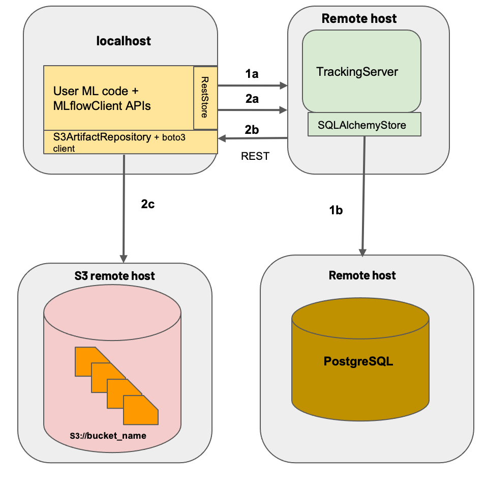

# Simple Docker mlflow server

Very over-simplistic way to publish a docker image with the dependencies needed to run an instance of mlflow server using a postgres backend and s3 store, this to enable tracking as explained in the [mlflow docs](https://mlflow.org/docs/latest/tracking.html#scenario-4-mlflow-with-remote-tracking-server-backend-and-artifact-stores).



## Usage

This image is intended to be used through `docker compose`. I am going to deploy this using portainer in my homelab.

Example docker compose:

```yaml
version: '3.7'

services:
  db:
    restart: unless-stopped
    image: postgres:15
    healthcheck:
      test: ["CMD-SHELL", "pg_isready -U $$POSTGRES_USER -d $$POSTGRES_DB"]
      interval: 5s
      timeout: 5s
      retries: 10
    ports:
      - "${POSTGRES_PORT}:5432"
    environment:
      - POSTGRES_USER=${POSTGRES_USER}
      - POSTGRES_PASSWORD=${POSTGRES_PASSWORD}
      - POSTGRES_DB=${POSTGRES_DB}
    volumes:
      - dbdata:/var/lib/postgresql/data
  mlflow:
    restart: unless-stopped
    build: .
    image: mlflow_server
    depends_on:
      db:
        condition: service_healthy
    ports:
      - "5000:5000"
    environment:
      - AWS_ACCESS_KEY_ID=${AWS_ACCESS_KEY_ID}
      - AWS_SECRET_ACCESS_KEY=${AWS_SECRET_ACCESS_KEY}
      - BACKEND_URI=postgresql://${POSTGRES_USER}:${POSTGRES_PASSWORD}@db:5432/${POSTGRES_DB}
      - ARTIFACTS_DESTINATION=${S3_ROOT}

volumes:
    dbdata:

```
